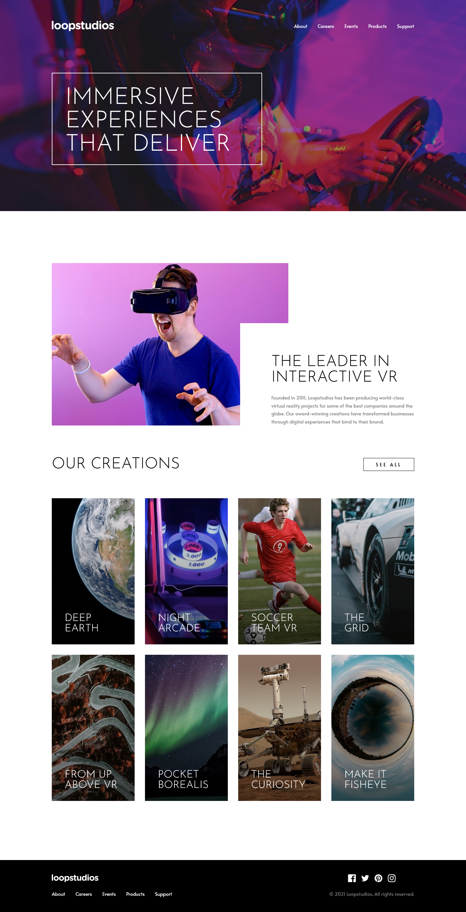

# Frontend Mentor - Loopstudios landing page solution

This is a solution to the [Loopstudios landing page challenge on Frontend Mentor](https://www.frontendmentor.io/challenges/loopstudios-landing-page-N88J5Onjw). Frontend Mentor challenges help you improve your coding skills by building realistic projects.

## Table of contents

-   [Overview](#overview)
    -   [The challenge](#the-challenge)
    -   [Screenshot](#screenshot)
    -   [Links](#links)
-   [My process](#my-process)
    -   [Built with](#built-with)
    -   [What I learned](#what-i-learned)
    -   [Continued development](#continued-development)
-   [Author](#author)

## Overview

### The challenge

Users should be able to:

-   View the optimal layout for the site depending on their device's screen size
-   See hover states for all interactive elements on the page

### Screenshot

### Links

-   Solution URL: [View solution on Frontend Mentor](https://www.frontendmentor.io/solutions/)
-   Live Site URL: [View live site](https://alexander3717.github.io/LoopstudiosLandingPage/)

## My process

### Built with

-   SASS features
-   CSS custom properties
-   Flexbox
-   CSS Grid
-   Mobile-first workflow

### What I learned

I wouldn't say I encountered a lot of new mechanics but this project tested what I've learned so far and made me use it in new ways. For the first time I created a fully responsive navbar with animations and everything. It also hides on scroll and shows again if you scroll up.

### Continued development

This took me way more time than it should have I think. And despite that, I have no doubt that the code could use a lot of improvements and a better structure. I just don't know how to choose the right one! I am still a beginner, so some rigid one, used in professional settings is probably too much bloat for me but I feel like there's gotta be a faster, better way to do all of this. Maybe I just need to get to JS and CSS frameworks already.

## Author

-   Frontend Mentor - [@Alexander3717](https://www.frontendmentor.io/profile/Alexander3717)
